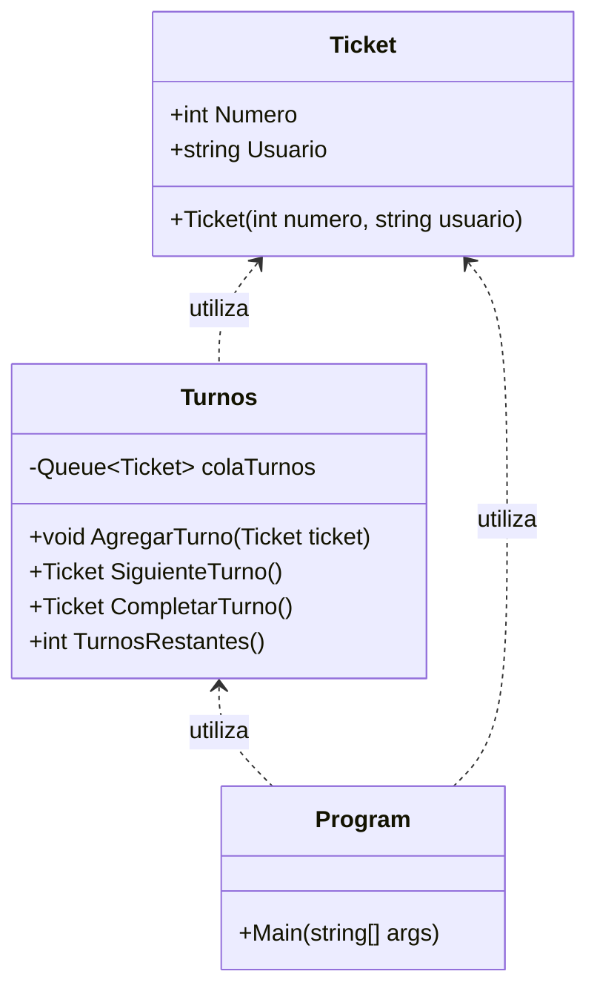

# Sistema de Turnos

---

## Índice

1. [Descripción](#descripción)
2. [Instalación de Git y conexión a GitHub](#instalación-de-git-y-conexión-a-github)
3. [Configuración del entorno de trabajo en C#](#configuración-del-entorno-de-trabajo-en-c)
4. [Clonar el repositorio](#clonar-el-repositorio)
5. [Cómo correr el proyecto](#cómo-correr-el-proyecto)
6. [Diagrama de clases](#diagrama-de-clases)
7. [Autores](#autores)
8. [Estructuras de datos utilizadas: Cola y Lista](#estructuras-de-datos-utilizadas-cola-y-lista)
9. [Algoritmo de ordenamiento: Counting Sort](#algoritmo-de-ordenamiento-counting-sort)
10. [Posibles aplicaciones](#posibles-aplicaciones)

---

## Descripción
Sistema de gestión de turnos permite asignar tickets a los usuarios, gestionar la atención en orden y mostrar la lista de atendidos ordenada alfabéticamente usando el algoritmo Counting Sort.

---

## Instalación de Git y conexión a GitHub

1. **Descargar e instalar Git:**
	 - Ve a [https://git-scm.com/downloads](https://git-scm.com/downloads) y descarga el instalador para tu sistema operativo.
	 - Sigue los pasos del instalador y verifica la instalación ejecutando en la terminal:
		 ```
		 git --version
		 ```

2. **Configurar Git y conectar a GitHub:**
	 - Configura tu nombre de usuario y correo:
		 ```
		 git config --global user.name "Tu Nombre"
		 git config --global user.email "tuemail@ejemplo.com"
		 ```
	 - Crea una cuenta en [GitHub](https://github.com/) si no tienes una.
	 - Genera una clave SSH y agrégala a tu cuenta de GitHub (opcional pero recomendado):
		 ```
		 ssh-keygen -t ed25519 -C "tuemail@ejemplo.com"
		 ```
	 - Sigue las instrucciones de GitHub para agregar tu clave SSH: [Guía oficial](https://docs.github.com/es/authentication/connecting-to-github-with-ssh)

---

## Configuración del entorno de trabajo en C#

1. Instala [.NET SDK](https://dotnet.microsoft.com/download) (recomendado .NET 8.0 o superior).
2. Instala un editor como [Visual Studio Code](https://code.visualstudio.com/) o [Visual Studio Community](https://visualstudio.microsoft.com/es/vs/community/).
3. (Opcional) Instala la extensión de C# para tu editor.

---

## Clonar el repositorio

```sh
git clone https://github.com/edwinquisbertm/Sistema-de-Gestion-de-Turnos.git
cd Sistema-de-Gestion-de-Turnos
```


---

## Cómo correr el proyecto

```sh
dotnet build
dotnet run
```

---


## Diagrama de clases



---

## Autores

- Edwin Quisbert Montalvo
- Wilson Aguilar Lima
- David Jairo Vasquez Velarde

---

## Estructuras de datos utilizadas: Cola y Lista
En este proyecto se utilizan dos estructuras de datos principales:

### Cola (Queue)

Se emplea una cola para gestionar los turnos de atención. Una cola es una estructura de datos FIFO (First-In, First-Out), lo que significa que el primer elemento en entrar es el primero en salir. Esto es ideal para sistemas de turnos, ya que garantiza que los usuarios sean atendidos en el mismo orden en que solicitaron su ticket, asegurando equidad y orden en la atención.

### Lista (List)

Se utiliza una lista para almacenar los usuarios que ya han sido atendidos. Esta lista permite registrar el historial de atención y posteriormente ordenarla alfabéticamente usando el algoritmo Counting Sort. La lista es adecuada aquí porque permite almacenar, recorrer y ordenar fácilmente los elementos una vez que han salido de la cola.

#### - Justificación

La combinación de una cola para la gestión de turnos y una lista para el registro y ordenamiento de los atendidos permite separar claramente la lógica de atención (orden de llegada) de la lógica de reporte o análisis (orden alfabético), optimizando el funcionamiento y la claridad del sistema.

---

## Algoritmo de ordenamiento: Counting Sort

Para ordenar los nombres de los usuarios atendidos, se utiliza el algoritmo Counting Sort adaptado para cadenas de texto. Este método cuenta la frecuencia de cada carácter en cada posición del nombre (de derecha a izquierda) y reordena la lista de usuarios de manera eficiente, logrando un orden alfabético estable y rápido, especialmente útil cuando los nombres tienen longitud similar y el alfabeto es limitado.

### - Posibles aplicaciones

- Gestión de turnos en bancos, hospitales, farmacias, oficinas públicas, etc.
- Sistemas de atención al cliente en empresas.
- Control de acceso y atención en eventos o instituciones educativas.
- Cualquier situación donde se requiera organizar la atención de personas en orden y registrar el historial de atención.

---